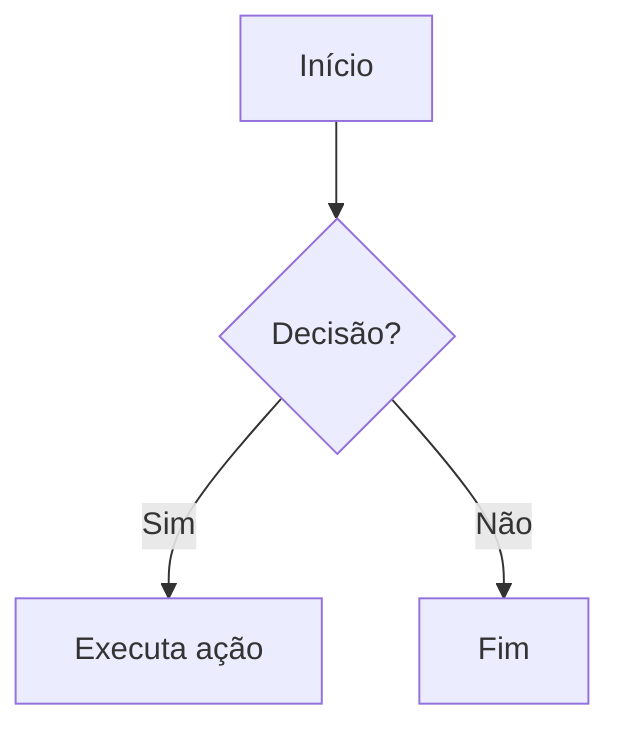

# Guia de Formatação da Documentação

## 📌 Imagens

Para inserir imagens na documentação, utilize a seguinte estrutura :

```jsx
<p style={{textAlign: 'center'}}>Figura 1 - Canvas Proposta de Valor</p>
<div style={{margin: 25}}>
    <div style={{textAlign: 'center'}}>
        
        <br />
    </div>
</div>
<p style={{textAlign: 'center'}}>Fonte: Os autores (2025)</p>
```

### Exemplo de Imagem

<p style={{textAlign: 'center'}}>Figura 1 - Canvas Proposta de Valor</p>
<div style={{margin: 25}}>
    <div style={{textAlign: 'center'}}>
    IMAGEM AQUI
</div>
</div>
<p style={{textAlign: 'center'}}>Fonte: Os autores (2025)</p>

## 📌 Tabelas

Para inserir tabelas na documentação, utilize a seguinte estrutura:

```markdown
<p style={{textAlign: 'center'}}>Tabela 1 - Exemplo de Tabela</p>

| Coluna 1 | Coluna 2 | Coluna 3 |
|----------|----------|----------|
| Valor 1  | Valor 2  | Valor 3  |

<p style={{textAlign: 'center'}}>Fonte: Os autores (2025)</p>
```

### Exemplo de Tabela

<p style={{textAlign: 'center'}}>Tabela 1 - Exemplo de Tabela</p>

| Coluna 1 | Coluna 2 | Coluna 3 |
|----------|----------|----------|
| Valor 1  | Valor 2  | Valor 3  |

<p style={{textAlign: 'center'}}>Fonte: Os autores (2025)</p>

## 📌 Fluxogramas

Para inserir fluxogramas utilizando Mermaid, utilize a seguinte estrutura:

```markdown
<p style={{textAlign: 'center'}}>Figura 2 - Fluxo de Exemplo</p>



<p style={{textAlign: 'center'}}>Fonte: Os autores (2025)</p>
```

### Exemplo de Fluxograma

<p style={{textAlign: 'center'}}>Figura 2 - Fluxo de Exemplo</p>


<p style={{textAlign: 'center'}}>Fonte: Os autores (2025)</p>

## Padrões de Formatação

### Numeração

- **Figuras**: Numerar sequencialmente (Figura 1, Figura 2, etc.)
- **Tabelas**: Numerar sequencialmente (Tabela 1, Tabela 2, etc.)

### Fontes

- Sempre incluir fonte nas imagens e tabelas
- Para conteúdo próprio: "Fonte: Os autores (2025)"
- Para conteúdo adaptado: "Fonte: Adaptado de [Fonte Original] pelos autores (2025)"

### Estilos

- **Centralização**: Utilizar `textAlign: 'center'` para títulos e fontes
- **Margens**: Utilizar `margin: 25` para espaçamento das imagens
- **Largura**: Ajustar `width` conforme necessário (recomendado: 500-800px)

### Estrutura de Arquivos

- Imagens devem ser salvas em `static/img/`
- Utilizar nomes descritivos para os arquivos
- Formatos recomendados: PNG, JPG, SVG
